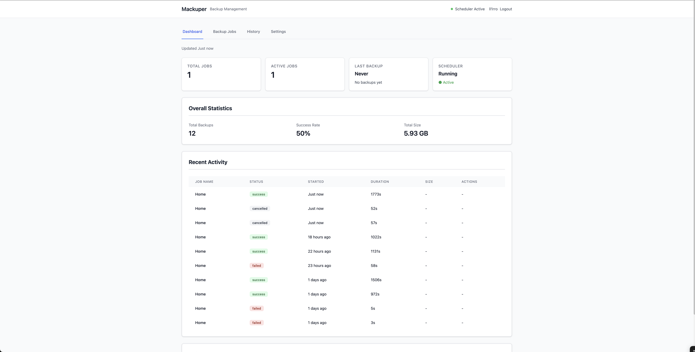

# Mackuper

**Docker-based backup solution for AWS S3** - Simple, reliable, and resource-efficient backup management with a clean web interface.




*More screenshots: [Jobs](docs/images/jobs.png) | [History](docs/images/history.png) | [Settings](docs/images/settings.png)*

## Table of Contents

- [Features](#features)
- [Quick Start](#quick-start)
  - [Using Docker](#using-docker-quickest)
  - [Using Docker Compose](#using-docker-compose-recommended-for-customization)
  - [Manual Installation](#manual-installation-development)
- [Prerequisites](#prerequisites)
  - [AWS S3 Permissions](#aws-s3-permissions)
- [Configuration](#configuration)
  - [Environment Variables](#environment-variables)
  - [AWS Credentials](#aws-credentials)
- [Usage](#usage)
  - [Creating a Backup Job](#creating-a-backup-job)
  - [Backup Source Types](#backup-source-types)
  - [Cron Schedule Examples](#cron-schedule-examples)
- [Architecture](#architecture)
  - [Technology Stack](#technology-stack)
  - [Directory Structure](#directory-structure)
  - [Backup Workflow](#backup-workflow)
  - [S3 Storage Structure](#s3-storage-structure)
- [Web Interface](#web-interface)
- [Logging](#logging)
- [Troubleshooting](#troubleshooting)
  - [Setup Wizard Issues](#setup-wizard-issues)
  - [Backup Job Issues](#backup-job-issues)
  - [Database Issues](#database-issues)
  - [Performance Issues](#performance-issues)
- [Security](#security)
  - [Best Practices](#best-practices)
  - [Credential Storage](#credential-storage)
- [Docker Deployment](#docker-deployment)
  - [Production Deployment](#production-deployment)
  - [Volume Management](#volume-management)
  - [Custom Port](#custom-port)
- [Development](#development)
  - [Running Tests](#running-tests)
  - [Project Structure](#project-structure)
  - [Contributing](#contributing)
- [FAQ](#faq)
- [License](#license)
- [Support](#support)
- [Credits](#credits)

---

## Features

- 🔐 **Secure** - Encrypted AWS credentials, password-protected access, CSRF protection
- 📦 **Flexible Backup Sources** - Local directories and remote SSH/SFTP servers
- ⚙️ **Multiple Compression Formats** - ZIP, TAR.GZ, TAR.BZ2, TAR.XZ, or none
- ☁️ **AWS S3 Storage** - Automatic uploads with multipart support for large files
- 📅 **Scheduled Backups** - Cron-based scheduling with APScheduler
- 🔄 **Retention Policies** - Automatic cleanup of old backups
- 📊 **Web Dashboard** - Clean, intuitive interface for managing backups
- 🐳 **Docker-Ready** - Single container deployment with docker-compose
- 📝 **Comprehensive Logging** - Detailed logs for troubleshooting and audit

## Quick Start

### Using Docker (Quickest)

Run Mackuper directly from Docker Hub:

```bash
docker run -d \
  --name mackuper \
  -p 5000:5000 \
  -v mackuper-data:/data \
  --restart unless-stopped \
  lirem/mackuper:latest
```

**Access the web interface:**
- Open http://localhost:5000 in your browser
- Complete the setup wizard (create admin account, configure AWS S3)
- Start creating backup jobs!

**Note**: This creates a Docker volume named `mackuper-data` for persistent storage.

### Using Docker Compose (Recommended for Customization)

1. **Clone the repository:**
   ```bash
   git clone https://github.com/lirem/mackuper.git
   cd mackuper
   ```

2. **Create environment file (optional):**
   ```bash
   cp .env.example .env
   # Edit .env with your preferred settings
   ```

3. **Start the application:**
   ```bash
   docker-compose up -d
   ```

4. **Access the web interface:**
   Open http://localhost:5000 in your browser

5. **Complete the setup wizard:**
   - Create admin account
   - Configure AWS S3 credentials
   - Test connection

That's it! You're ready to create backup jobs!

---

### Manual Installation (Development)

1. **Install Python 3.11+:**
   ```bash
   python --version  # Should be 3.11 or higher
   ```

2. **Install dependencies:**
   ```bash
   pip install -r requirements.txt
   ```

3. **Run the development server:**
   ```bash
   python run.py
   ```

4. **Access the application:**
   Open http://localhost:5000 in your browser

---

## Prerequisites

### Required

- **Docker** and **Docker Compose** (for Docker deployment)
  - OR **Python 3.11+** (for manual installation)
- **AWS S3 Bucket** with appropriate permissions
- **AWS Access Credentials** (Access Key ID and Secret Access Key)

### AWS S3 Permissions

Your AWS IAM user/role needs the following S3 permissions:

```json
{
    "Version": "2012-10-17",
    "Statement": [
        {
            "Sid": "ListBucket",
            "Effect": "Allow",
            "Action": [
                "s3:ListBucket",
                "s3:GetBucketLocation"
            ],
            "Resource": "arn:aws:s3:::your-backup-bucket-name"
        },
        {
            "Sid": "ReadWriteObjects",
            "Effect": "Allow",
            "Action": [
                "s3:PutObject",
                "s3:GetObject",
                "s3:DeleteObject",
                "s3:AbortMultipartUpload",
                "s3:ListMultipartUploadParts"
            ],
            "Resource": "arn:aws:s3:::your-backup-bucket-name/*"
        }
    ]
}
```

**Important Notes:**
- Replace `your-backup-bucket-name` with your actual bucket name
- `s3:AbortMultipartUpload` and `s3:ListMultipartUploadParts` are required for large file uploads (>100MB)
- `s3:GetBucketLocation` is needed for S3 connection testing

---

## Configuration

### Environment Variables

Create a `.env` file based on `.env.example`:

```bash
# Flask Configuration
FLASK_ENV=production                      # Environment: production or development
SECRET_KEY=your-secret-key-here-change-this  # Change this! Generate with: python -c "import secrets; print(secrets.token_hex(32))"

# Database (paths inside Docker container)
DATABASE_URL=sqlite:////data/mackuper.db  # Database file location inside container

# Directories (paths inside Docker container)
TEMP_DIR=/data/temp                       # Temporary files during backup creation
LOCAL_BACKUP_DIR=/data/local_backups      # Optional local backup storage

# Server
PORT=5000                                 # Port inside container (mapped to host port in docker-compose.yml)

# HTTPS (optional)
HTTPS_ENABLED=false                       # Enable if running behind HTTPS reverse proxy
```

### AWS Credentials

AWS credentials are configured through the web interface during setup:
1. Access the setup wizard at http://localhost:5000/setup
2. Enter your AWS credentials
3. Select your bucket and region
4. Test the connection

Credentials are encrypted and stored securely in the database.

---

## Usage

### Creating a Backup Job

1. **Navigate to the Jobs tab** in the web interface
2. **Click "Create New Job"**
3. **Configure the backup:**
   - **Job Name**: Descriptive name for your backup
   - **Source Type**: Local or SSH
   - **Source Path**: Directory or file to backup
   - **Compression**: Choose format (ZIP, TAR.GZ, etc.)
   - **Schedule**: Cron expression (e.g., `0 2 * * *` for daily at 2 AM)
   - **Retention**: How many days to keep backups

4. **Save and enable** the job

### Backup Source Types

#### Local Source
Back up files from the server running Mackuper:
- **Source Path**: `/path/to/directory` or `/path/to/file`
- Example: `/home/user/documents`

**Important:** By default, the Docker container can only access files inside the container. To backup files from your **host machine**, you need to mount them into the container.

**Mounting Host Directories:**

1. **Using docker-compose.yml** (Recommended):

   Edit [docker-compose.yml](docker-compose.yml) to add volume mounts:
   ```yaml
   volumes:
     - mackuper-data:/data
     - /path/on/host:/backup/documents:ro     # Mount host directory (read-only)
     - /var/www/html:/backup/websites:ro      # Another example
   ```

   Then restart: `docker-compose down && docker-compose up -d`

2. **Using docker run command:**

   Add `-v` flags when running the container:
   ```bash
   docker run -d \
     --name mackuper \
     -p 5000:5000 \
     -v mackuper-data:/data \
     -v /home/user/documents:/backup/documents:ro \
     -v /var/www/html:/backup/websites:ro \
     --restart unless-stopped \
     lirem/mackuper:latest
   ```

**Creating Backup Jobs for Mounted Directories:**
- **Source Type**: Select "Local"
- **Source Path**: Use the container path (e.g., `/backup/documents`)
- The `:ro` flag mounts directories as read-only for safety

**Example:**
- Host path: `/home/user/documents`
- Mount in docker-compose: `/home/user/documents:/backup/docs:ro`
- Backup job source path: `/backup/docs`

#### SSH Source
Back up files from a remote server via SSH/SFTP:
- **Hostname**: Remote server address
- **Port**: SSH port (default: 22)
- **Username**: SSH username
- **Authentication**: Password or private key
- **Source Path**: Remote path to backup

### Cron Schedule Examples

```bash
0 2 * * *          # Daily at 2:00 AM
0 */6 * * *        # Every 6 hours
0 0 * * 0          # Weekly on Sunday at midnight
0 3 1 * *          # Monthly on the 1st at 3:00 AM
*/30 * * * *       # Every 30 minutes
0 0,12 * * *       # Twice daily (midnight and noon)
```

---

## Architecture

### Technology Stack

- **Backend**: Flask (Python 3.11+), SQLAlchemy, APScheduler
- **Frontend**: Alpine.js, Tailwind CSS
- **Storage**: SQLite, AWS S3
- **Deployment**: Docker, Gunicorn
- **Security**: Fernet encryption, Flask-Login, CSRF protection

### Directory Structure

```
./data/                     # Persistent volume
├── mackuper.db            # SQLite database
├── logs/                  # Application logs
│   └── mackuper.log      # Main log file (10MB max, 10 backups)
├── temp/                  # Temporary backup files (auto-cleanup)
└── local_backups/         # Optional local backup storage
    └── {job_name}/
        └── {YYYY}/{MM}/
```

### Backup Workflow

1. **Acquire Source** - Download files from local or SSH source
2. **Compress** - Create archive with selected compression format
3. **Upload to S3** - Upload to S3 with structured key: `{job}/{YYYY}/{MM}/{filename}`
4. **Local Storage** - Optionally store locally
5. **Cleanup** - Remove temporary files
6. **Log Results** - Record in backup history

### S3 Storage Structure

```
your-bucket/
├── job-name/
│   ├── 2025/
│   │   ├── 01/
│   │   │   ├── backup_20250101_020000.tar.gz
│   │   │   └── backup_20250102_020000.tar.gz
│   │   └── 02/
│   │       └── backup_20250201_020000.tar.gz
```

---

## Web Interface

### Dashboard Tab
- **Overview Cards**: Total jobs, active jobs, last backup, scheduler status
- **Statistics**: Success rate, total backups, total size
- **Recent Activity**: Last 10 backup executions with status

### Jobs Tab
- **Job Management**: Create, edit, delete, enable/disable
- **Manual Execution**: Run any job immediately
- **Job Configuration**: Source, schedule, compression, retention

### History Tab
- **Backup History**: View all past backup executions
- **Filtering**: By status, job, time range
- **Log Viewer**: View detailed execution logs
- **Cleanup**: Delete old history records (minimum 30 days)

### Settings Tab
- **AWS Configuration**: Update S3 credentials and bucket
- **Connection Test**: Verify S3 access
- **Password Management**: Change admin password
- **About**: Version and system information

---

## Logging

Mackuper provides comprehensive logging for debugging and audit purposes:

- **Log Location**: `./data/logs/mackuper.log`
- **Rotation**: 10MB per file, 10 backup files
- **Format**: `[timestamp] LEVEL [module.function:line] message`
- **Levels**: DEBUG (development), INFO (production)

**View logs in real-time:**
```bash
# Docker
docker-compose logs -f mackuper

# Manual installation
tail -f ./data/logs/mackuper.log
```

**Log content includes:**
- Backup execution steps
- S3 upload/download operations
- SSH connections
- Errors and exceptions with stack traces
- User actions (login, job changes, etc.)

---

## Troubleshooting

### Setup Wizard Issues

**"Server returned an invalid response"**
- Check server logs: `docker-compose logs mackuper` or `tail -f data/logs/mackuper.log`
- Verify AWS credentials are correct
- Ensure S3 bucket exists and is accessible

**"Access denied to bucket"**
- Verify IAM permissions include `s3:PutObject`, `s3:ListBucket`, `s3:DeleteObject`
- Check bucket policy doesn't block access
- Verify region matches bucket location

**"Bucket does not exist"**
- Verify bucket name is spelled correctly (no typos)
- Ensure bucket is in the selected region
- Check bucket wasn't deleted

### Backup Job Issues

**Backup fails with SSH connection error**
- Verify SSH credentials are correct
- Test SSH connection manually: `ssh user@hostname`
- Check firewall allows SSH (port 22 or custom)
- Verify remote path exists and is readable

**Backup fails during compression**
- Check available disk space in `/data/temp`
- Verify source files aren't locked/in-use
- Check file permissions

**Upload to S3 fails**
- Verify internet connectivity
- Check AWS credentials haven't expired
- Ensure S3 bucket still exists
- Verify IAM permissions

**Job doesn't run on schedule**
- Check scheduler status in Dashboard (should show "Running")
- Verify cron expression is valid (use https://crontab.guru)
- Check container hasn't been stopped
- Review logs for scheduler errors

### Database Issues

**"Database is locked"**
- Ensure only one Mackuper instance is running
- Check no other process is accessing `mackuper.db`
- Restart the container: `docker-compose restart`

**Data disappeared after restart**
- Verify data volume is properly mounted
- Check `docker-compose.yml` volume configuration
- Ensure `./data` directory permissions

### Performance Issues

**Slow backup uploads**
- Large files use multipart upload (automatic for files > 100MB)
- Check network bandwidth to S3
- Consider different S3 region closer to your server

**High memory usage**
- Compression is memory-intensive for large files
- Consider using less compression (e.g., ZIP instead of XZ)
- Or use "none" compression for pre-compressed data

---

## Security

### Best Practices

1. **Change Default Secret Key**
   - Set a strong, random `SECRET_KEY` in `.env`
   - Generate: `python -c "import secrets; print(secrets.token_hex(32))"`

2. **Use Strong Passwords**
   - Minimum 8 characters
   - Mix of uppercase, lowercase, numbers

3. **Restrict Network Access**
   - Use firewall to limit access to port 5000
   - Consider running behind reverse proxy with HTTPS

4. **Regular Backups**
   - Back up `./data/mackuper.db` database file
   - Store backup of AWS credentials separately

5. **Monitor Logs**
   - Review logs regularly for unusual activity
   - Check for failed login attempts

### Credential Storage

- **AWS Credentials**: Encrypted with Fernet (AES-128) before storage
- **SSH Passwords**: Encrypted with Fernet before storage
- **Master Key**: Derived from user password using PBKDF2-HMAC-SHA256 (480,000 iterations)
- **Passwords**: Hashed with PBKDF2-SHA256 before storage

---

## Docker Deployment

### Production Deployment

```bash
# Build custom image
docker build -f docker/Dockerfile -t mackuper:latest .

# Run with docker-compose
docker-compose up -d

# Check status
docker-compose ps

# View logs
docker-compose logs -f mackuper

# Stop
docker-compose down

# Update to new version
git pull
docker-compose down
docker-compose up -d --build
```

### Volume Management

**Backup your data:**
```bash
# Backup database and files
tar -czf mackuper-backup-$(date +%Y%m%d).tar.gz ./data
```

**Restore from backup:**
```bash
# Stop container
docker-compose down

# Restore data
tar -xzf mackuper-backup-YYYYMMDD.tar.gz

# Start container
docker-compose up -d
```

### Custom Port

Edit `docker-compose.yml`:
```yaml
ports:
  - "8080:5000"  # Change 8080 to your preferred port
```

Then restart:
```bash
docker-compose down
docker-compose up -d
```

---

## Development

### Running Tests

```bash
# Install test dependencies
pip install pytest pytest-cov

# Run tests
pytest tests/

# With coverage
pytest --cov=app tests/
```

### Project Structure

```
mackuper/
├── app/                    # Application package
│   ├── __init__.py        # Flask app factory
│   ├── models.py          # Database models
│   ├── auth.py            # Authentication
│   ├── scheduler.py       # Job scheduler
│   ├── backup/            # Backup system
│   ├── routes/            # API endpoints
│   ├── utils/             # Utilities
│   └── static/            # Frontend assets
├── templates/             # HTML templates
├── docker/                # Docker files
├── data/                  # Persistent data (gitignored)
├── tests/                 # Test suite
└── requirements.txt       # Python dependencies
```

### Contributing

Contributions are welcome! Please:
1. Fork the repository
2. Create a feature branch
3. Make your changes
4. Add tests
5. Submit a pull request

---

## FAQ

**Q: Can I backup to multiple S3 buckets?**
A: Currently one S3 bucket per installation. Run multiple Mackuper instances for multiple buckets.

**Q: Does it support backup encryption?**
A: S3 server-side encryption (SSE) is supported if enabled on your bucket. Client-side encryption is not currently implemented.

**Q: Can I restore backups from the UI?**
A: Not currently. Download from S3 and extract manually. A restore feature may be added in future versions.

**Q: What happens if backup fails?**
A: Failed backups are logged with detailed error messages in the History tab and log files. You'll see the failure status in the dashboard.

**Q: Can I run backups manually?**
A: Yes! Click "Run Now" on any job in the Jobs tab to execute immediately.

**Q: How do I migrate to a new server?**
A: Copy the `./data` directory to the new server and start Mackuper. All settings, jobs, and history will be preserved.

---

## License

Apache License 2.0 - see LICENSE file for details.

---

## Support

- **Issues**: https://github.com/lirem/mackuper/issues
- **Documentation**: https://github.com/lirem/mackuper/wiki

---

## Credits

Built with:
- [Flask](https://flask.palletsprojects.com/)
- [Alpine.js](https://alpinejs.dev/)
- [Tailwind CSS](https://tailwindcss.com/)
- [APScheduler](https://apscheduler.readthedocs.io/)
- [boto3](https://boto3.amazonaws.com/v1/documentation/api/latest/index.html)
- [Paramiko](https://www.paramiko.org/)
